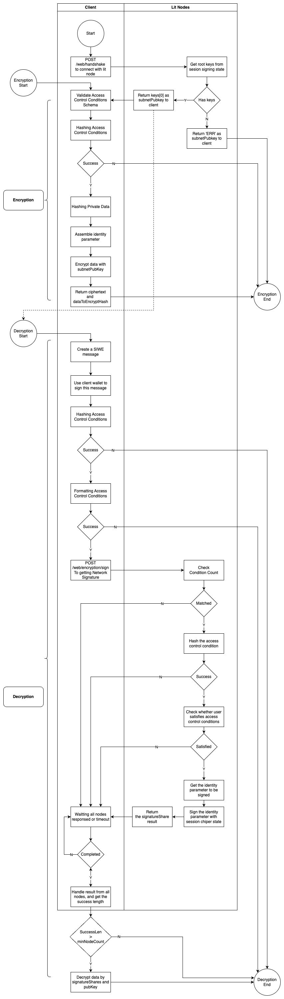

# Lit Protocol

## How Does Lit Protocol Work

### [Introduction](https://developer.litprotocol.com/resources/how-it-works#introduction)

Lit Protocol combines cutting-edge cryptography, sealed confidential hardware, and peer-to-peer networking to provide builders in web3 with the ability to use cryptographic keys and perform private compute jobs.

### [Lit Nodes](https://developer.litprotocol.com/resources/how-it-works#1-lit-nodes)

Each Lit Node is a sealed encrypted virtual machine running on an independently operated server. The fact that each node is “sealed” means that neither the operator of the Lit Node, nor any other party, can access the interior of the processor.

Each Lit node contains a JavaScript execution environment (Deno) and key shares. Each key share corresponds to a key pair that is "shared" among all participating operators, created using distributed key generation (DKG).

### [The Lit Network](https://developer.litprotocol.com/resources/how-it-works#2-the-lit-network)

The Lit network is composed of a collection of Lit nodes. All nodes must stake tokens in order to participate in the “active” node operator set, providing crypto-economic security guarantees.

## [AccessControl & Encryption](https://developer.litprotocol.com/sdk/access-control/quick-start)

You can use the Lit network to encrypt your data and store it privately on the open web. This guide will show you how you can encrypt a simple message with Lit, create an Access Control Condition (ACC), and permit decryption by users who meet the condition you set.

### Rules

- The decryption access control conditions must be the same as the encryption.
- The defined access control conditions must be met.

### Encryption & Decryption Flow Diagram



### Client Encryption Flow

1. Validate Params: https://github.com/LIT-Protocol/js-sdk/blob/master/packages/lit-node-client-nodejs/src/lib/lit-node-client-nodejs.ts#L1416
2. Validate Access Control Conditions Schema: https://github.com/LIT-Protocol/js-sdk/blob/master/packages/lit-node-client-nodejs/src/lib/lit-node-client-nodejs.ts#L1430
3. Hashing Access Control Conditions: phttps://github.com/LIT-Protocol/js-sdk/blob/master/ackages/lit-node-client-nodejs/src/lib/lit-node-client-nodejs.ts#L1434
4. Hashing Private Data: https://github.com/LIT-Protocol/js-sdk/blob/master/packages/lit-node-client-nodejs/src/lib/lit-node-client-nodejs.ts#L1452
5. Assemble identity parameter: https://github.com/LIT-Protocol/js-sdk/blob/master/packages/lit-node-client-nodejs/src/lib/lit-node-client-nodejs.ts#L1462
6. Encrypt using public key from server: https://github.com/LIT-Protocol/js-sdk/blob/master/packages/lit-node-client-nodejs/src/lib/lit-node-client-nodejs.ts#L1468

### Client Decryption Flow

1. Validate Params: https://github.com/LIT-Protocol/js-sdk/blob/master/packages/lit-node-client-nodejs/src/lib/lit-node-client-nodejs.ts#L1507
2. Hashing Access Control Conditions: https://github.com/LIT-Protocol/js-sdk/blob/master/packages/lit-node-client-nodejs/src/lib/lit-node-client-nodejs.ts#L1522
3. Formatting Access Control Conditions: https://github.com/LIT-Protocol/js-sdk/blob/master/packages/lit-node-client-nodejs/src/lib/lit-node-client-nodejs.ts#L1539
4. Assemble identity parameter: https://github.com/LIT-Protocol/js-sdk/blob/master/packages/lit-node-client-nodejs/src/lib/lit-node-client-nodejs.ts#L1556
5. Get Network Signature, call API `/web/encryption/sign` with access control conditions to all nodes, and if the success node count is less than the min node count, return an error: https://github.com/LIT-Protocol/js-sdk/blob/master/packages/lit-node-client-nodejs/src/lib/lit-node-client-nodejs.ts#L1564
6. Decrypt if step 5 is success: https://github.com/LIT-Protocol/js-sdk/blob/master/packages/lit-node-client-nodejs/src/lib/lit-node-client-nodejs.ts#L1556

### Server Encryption Sign Flow

1. Check Condition Count: https://github.com/LIT-Protocol/Node/blob/HEAD/rust/lit-node/src/endpoints/web_client.rs#L320
2. Hash the access control condition: https://github.com/LIT-Protocol/Node/blob/HEAD/rust/lit-node/src/endpoints/web_client.rs#L331
3. Validate auth sig item: https://github.com/LIT-Protocol/Node/blob/HEAD/rust/lit-node/src/endpoints/web_client.rs#L351
4. Check whether user satisfies access control conditions: https://github.com/LIT-Protocol/Node/blob/HEAD/rust/lit-node/src/endpoints/web_client.rs#L416
5. Sign the identity parameter using the blsful secret key share: https://github.com/LIT-Protocol/Node/blob/HEAD/rust/lit-node/src/endpoints/web_client.rs#L452

#### Example Server Encryption Sign Full Flow With Condition Type: RPC

1. encryption_sign
   - https://github.com/LIT-Protocol/Node/blob/HEAD/rust/lit-node/src/endpoints/web_client.rs#L302
2. Check Condition Count
   - https://github.com/LIT-Protocol/Node/blob/HEAD/rust/lit-node/src/endpoints/web_client.rs#L320
3. check_multiple_access_control_conditions
   - https://github.com/LIT-Protocol/Node/blob/HEAD/rust/lit-node/src/endpoints/web_client.rs#L416
   - https://github.com/LIT-Protocol/Node/blob/HEAD/rust/lit-node/src/endpoints/web_client.rs#L1221
4. check_access_control_conditions
   - https://github.com/LIT-Protocol/Node/blob/HEAD/rust/lit-node/src/endpoints/web_client.rs#L1235
   - https://github.com/LIT-Protocol/Node/blob/HEAD/rust/lit-node/src/access_control/mod.rs#L111
5. check_condition_group
   - https://github.com/LIT-Protocol/Node/blob/HEAD/rust/lit-node/src/access_control/mod.rs#L129
6. check_condition
   - https://github.com/LIT-Protocol/Node/blob/HEAD/rust/lit-node/src/access_control/mod.rs#L221
   - https://github.com/LIT-Protocol/Node/blob/HEAD/rust/lit-node/src/access_control/mod.rs#L298
7. check_condition_via_rpc_method
   - https://github.com/LIT-Protocol/Node/blob/HEAD/rust/lit-node/src/access_control/mod.rs#L330
   - https://github.com/LIT-Protocol/Node/blob/HEAD/rust/lit-node/src/access_control/mod.rs#L444
8. check_return_value_int
   - https://github.com/LIT-Protocol/Node/blob/HEAD/rust/lit-node/src/access_control/mod.rs#L467
   - https://github.com/LIT-Protocol/Node/blob/HEAD/rust/lit-node/src/access_control/mod.rs#L1052
9. return error if condition not meet
   - https://github.com/LIT-Protocol/Node/blob/HEAD/rust/lit-node/src/endpoints/web_client.rs#L434
10. return signature_share
   - https://github.com/LIT-Protocol/Node/blob/HEAD/rust/lit-node/src/endpoints/web_client.rs#L459

### All type of conditions can be implemented in tee-worker

- [POAP](https://developer.litprotocol.com/sdk/access-control/evm/poap) is an integration with https://poap.xyz
  - check_condition_via_poap
    - https://github.com/LIT-Protocol/Node/blob/HEAD/rust/lit-node/src/access_control/mod.rs#L412
  - get_poaps_for_user
    - https://github.com/LIT-Protocol/Node/blob/HEAD/rust/lit-node/src/access_control/mod.rs#L417

- [Timelock](https://developer.litprotocol.com/sdk/access-control/evm/timelock): Time-based Access Control, this will get the latest block from your blockchain of choice, and compare it to the unix timestamp that was specified in the returnValueTest.
  - check_condition_via_timestamp
    - https://github.com/LIT-Protocol/Node/blob/HEAD/rust/lit-node/src/access_control/mod.rs#L347

- [SIWE](https://developer.litprotocol.com/sdk/access-control/evm/siwe): Sign In With Ethereum Parameters, see https://docs.login.xyz/
  - check_condition_via_siwe
    - https://github.com/LIT-Protocol/Node/blob/HEAD/rust/lit-node/src/access_control/mod.rs#L474

- [Lit action](https://developer.litprotocol.com/sdk/access-control/lit-action-conditions)
  - check_condition_via_lit_action
    - https://github.com/LIT-Protocol/Node/blob/HEAD/rust/lit-node/src/access_control/mod.rs#L506
  - execute_js
    - https://github.com/LIT-Protocol/Node/blob/HEAD/rust/lit-node/src/access_control/mod.rs#L563
      - https://github.com/LIT-Protocol/Node/blob/HEAD/rust/lit-node/src/functions/spawner.rs#L76
      - https://github.com/LIT-Protocol/Node/blob/HEAD/rust/lit-node/src/functions/mod.rs#L40

- [Custom contract calls](https://developer.litprotocol.com/sdk/access-control/evm/custom-contract-calls)
  - check_condition_via_contract_call
    - https://github.com/LIT-Protocol/Node/blob/HEAD/rust/lit-node/src/access_control/mod.rs#L325
    - https://github.com/LIT-Protocol/Node/blob/HEAD/rust/lit-node/src/access_control/mod.rs#L621

- [Basic Signature](https://developer.litprotocol.com/sdk/access-control/evm/basic-examples#a-specific-wallet-address): without method
  - check_condition_via_signature
    - https://github.com/LIT-Protocol/Node/blob/HEAD/rust/lit-node/src/access_control/mod.rs#L325
    - https://github.com/LIT-Protocol/Node/blob/HEAD/rust/lit-node/src/access_control/mod.rs#L334
  - substitute_special_params
    - https://github.com/LIT-Protocol/Node/blob/HEAD/rust/lit-node/src/access_control/mod.rs#L339
    - https://github.com/LIT-Protocol/Node/blob/HEAD/rust/lit-node/src/access_control/mod.rs#L1190

- [Basic RPC](https://developer.litprotocol.com/sdk/access-control/evm/basic-examples): with method
  - check_condition_via_rpc_method
    - https://github.com/LIT-Protocol/Node/blob/HEAD/rust/lit-node/src/access_control/mod.rs#L330
    - https://github.com/LIT-Protocol/Node/blob/HEAD/rust/lit-node/src/access_control/mod.rs#L444


### Run Test

```shell
nvm use
npm install
npm run accessControlConditions 
```

## [Decentralized Compute](https://developer.litprotocol.com/sdk/serverless-signing/overview)

Blockchains like Ethereum have smart contracts that let developers encode logic to change state. With Lit, you can encode logic that governs signing and encryption.

This logic is encoded using a Lit Action, an immutable JavaScript program that can be "assigned" to the key pairs generated on Lit and used to dictate how they are used.

### [Use `Fetch` in Lit Action Code](https://developer.litprotocol.com/sdk/serverless-signing/fetch)

The HTTP request will be sent out by all the Lit Nodes in parallel, and consensus is based on at least 2/3 of the nodes getting the same response. If less than 2/3 nodes get the same response, then the user can not collect the signature shares above the threshold and therefore cannot produce the final signature. Note that your HTTP request will be sent N times where N is the number of nodes in the Lit Network, because it's sent from every Lit Node in parallel.

## Resources

- Block Explorer: https://chain.litprotocol.com/
- RPC URL: https://chain-rpc.litprotocol.com/replica-http
